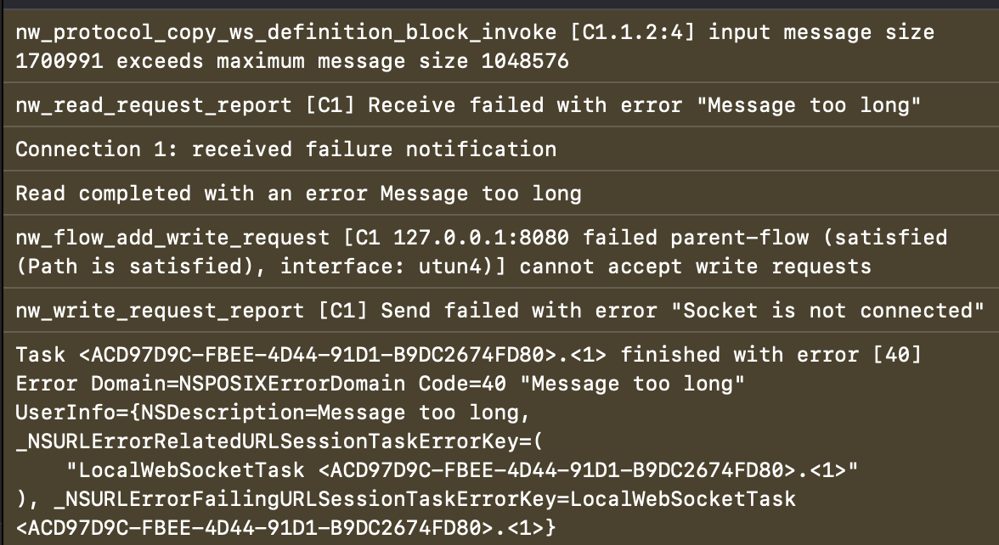

# ktor-websocket-ios
Demonstrates issue with darwin engine when frame size is too large.

# How to run?

1. Start server by running
 ```zsh
 swift run --package-path=hello
 ```

2. Init gradle:
```zsh
cd KtorWebsocketSample && ./gradlew wrapper  && cd ../
```

3. Open app project  by running
```zsh
open KtorWebsocketSample/iosApp/iosApp.xcodeproj
```

4. Run on iOS simulator.

> In case of issues, try to run gradle from Android studio


# Problem statement

Setting `maxFrameSize` should apply the value to [maximumMessageSize](https://developer.apple.com/documentation/foundation/urlsessionwebsockettask/3181203-maximummessagesize). Setting `maximumMessageSize` solves the problem when is called from native code. Kotlin counterpart doesn't have effect on the expected message size for some reason.

### Error example

